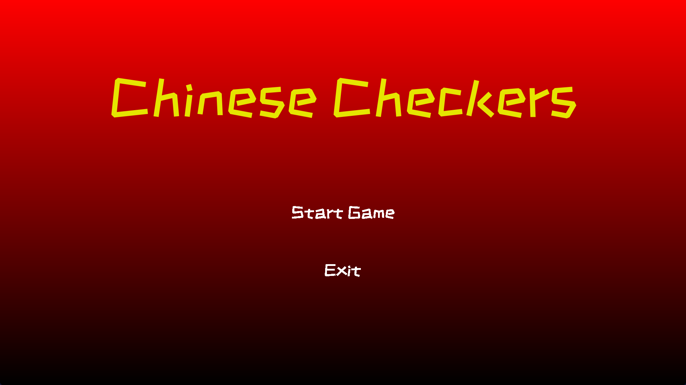

# 🐉 Chinese Checkers Game



## 🏓 Table of Contents

- [🔗 Presentation](#-presentation)
- [🤔 What is Chinese Checkers?](#-what-is-chinese-checkers)
- [🎮 How to Play](#-how-to-play)
  - [📚 Rules](#-rules)
- [🤖 AI Features](#-ai-features)
- [🚀 Technologies](#️-technologies)
- [🛠️ Setup and Installation](#️-setup-and-installation)
- [📝 License](#-license)
- [💖 Thanks for owner of this project](#-thanks-for-owner-of-this-project)
- [💕 Contributors](#-contributors)

## 🔗 Presentation

[Canva Presentation Click Here 👆](https://www.canva.com/design/DAGTKP0zSgY/pxgsmrTI43hyLHRegx7mhQ/edit?utm_content=DAGTKP0zSgY&utm_campaign=designshare&utm_medium=link2&utm_source=sharebutton)

## 🤔 What is Chinese Checkers?

**Chinese Checkers** is a strategy board game originating from Germany, known as "**Sternhalma**". It can be played by two, three, four, or six players, either individually or in teams. The game is a modern and simplified variation of the game **Halma**.

## 🎮 How to Play

The game is played on a star-shaped board with 121 spaces. Each player has 10 pieces of a unique color, which start at one of the six points of the star and aim to reach the opposite point.

The gameplay is turn-based, where a player can move one piece to an adjacent space or jump over other pieces. A player can jump over their own pieces or their opponents' pieces and can perform multiple jumps in a single turn.

The game ends when a player successfully moves all of their pieces to the opposite point. The first player to achieve this wins the game.

### 📚 Rules

- Players can move one piece to an adjacent space or jump over other pieces.
- Players can jump over their own or opponents' pieces.
- Multiple jumps are allowed in a single turn.
- The game ends when a player moves all their pieces to the opposite point.
- The player who moves all their pieces first wins.

## 🤖 AI Features

[Find our AI algorithms here](./bots)

| Name                  | Description                                           | Emotion |
| --------------------- | ----------------------------------------------------- | ------- |
| **Greedy Easy Bot**   | Moves a random piece to the best adjacent space.      | 🎲🤑    |
| **Greedy Normal Bot** | Always moves the topmost piece to the best space.     | 🤑      |
| **Greedy Hard Bot**   | Always moves and jumps throught the maximum distance. | 🤑🤑    |
| **Minimax Bot**       | Uses Minimax algorithm with Alpha-Beta Pruning.       | 🧠      |

> [!WARNING]
> The **Minimax Bot** is not recommended for 3 or more players because it worst performance.

## 🚀 Technologies

- [🐍 Python](https://www.python.org/) - Programming language.
- [🎨 Pygame](https://pyga.me/) - Set of Python modules designed for writing video games.
- [📚 PySide6](https://doc.qt.io/qtforpython-6/) - Official Python bindings for the Qt framework.

## 🛠️ Setup and Installation

1. Clone the repository:
   ```bash
   git clone https://github.com/PunGrumpy/ai-chinese-checkers.git
   cd ai-chinese-checkers
   ```
2. Create and activate a virtual environment:
   ```bash
   python -m venv .venv
   source .venv/bin/activate  # On Windows: .venv\Scripts\activate
   ```
3. Install the required dependencies:

   ```bash
   pip install -r requirements.txt
   ```

4. Run the game:
   ```bash
   python main.py
   ```

## 📝 License

This project is licensed under the GNU General Public License v3.0. See the [LICENSE](LICENSE) file for details.

## 💖 Thanks for owner of this project

<table>
  <tr>
    <td align="center">
      <a href="https://github.com/henrychess">
        
        <br />
        <sub><b>HenryChess</b></sub>
      </a>
      <br />
      <a title="Owner" href="https://github.com/henrychess/Chinese-Checkers">👑</a>
    </td>
  </tr>
</table>

## 💕 Contributors

<table>
  <tr>
    <td align="center">
      <a href="https://github.com/PunGrumpy">
        
        <br />
        <sub><b>PunGrumpy</b></sub>
      </a>
      <br />
      <a title="Algorithm Developer" href="https://github.com/PunGrumpy">🧠</a>
    </td>
    <td align="center">
      <a href="https://github.com/Bobby9326">
        
        <br />
        <sub><b>Bobby9326</b></sub>
      </a>
      <br />
      <a title="Game Logic Developer" href="https://github.com/Bobby9326">🎮</a>
    </td>
  </tr>
</table>
